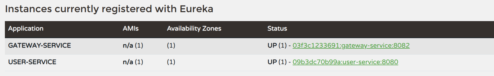
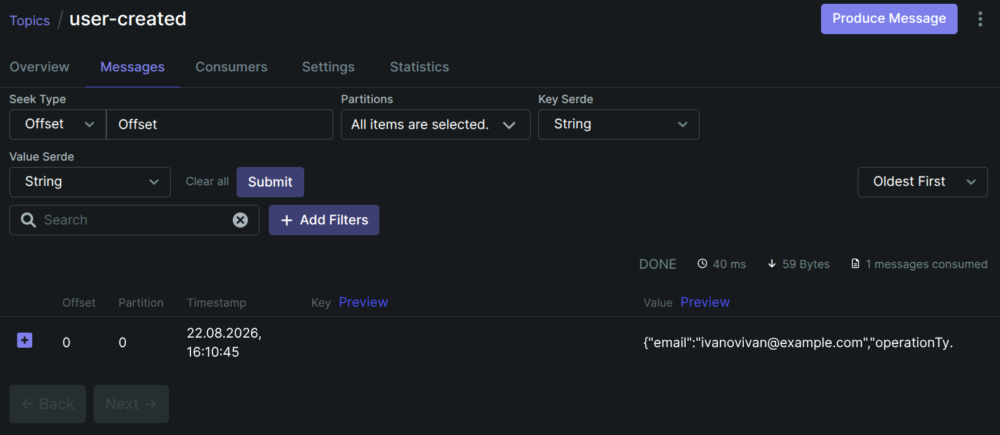

# Создать docker-compose.yml, который развернет всю микросервисную систему, включая Kafka, PostgreSQL, API Gateway, Service Discovery, External Configuration и 2 микросервиса(user-service и notification-service, созданные ранее). Проверить, что сервисы корректно взаимодействуют друг с другом в контейнерной среде.

- - - 
### Запущенные контейнеры  
``` 
CONTAINER ID   IMAGE                              COMMAND                  CREATED          STATUS          PORTS                                         NAMES
03f3c1233691   homework4-8-gateway-service        "java -jar app.jar j…"   19 minutes ago   Up 19 minutes   0.0.0.0:8082->8082/tcp, [::]:8082->8082/tcp   gateway-service
09b3dc70b99a   homework4-8-user-service           "java -jar app.jar"      19 minutes ago   Up 19 minutes   0.0.0.0:8080->8080/tcp, [::]:8080->8080/tcp   user-service
e825716cbb1d   homework4-8-notification-service   "java -jar app.jar"      19 minutes ago   Up 19 minutes   0.0.0.0:8081->8081/tcp, [::]:8081->8081/tcp   notification-service
ba7f1ed89f8a   postgres:15                        "docker-entrypoint.s…"   19 minutes ago   Up 19 minutes   0.0.0.0:5433->5432/tcp, [::]:5433->5432/tcp   postgres-user
8ef9552ec115   apache/kafka:latest                "/__cacert_entrypoin…"   19 minutes ago   Up 19 minutes   0.0.0.0:9092->9092/tcp, [::]:9092->9092/tcp   kafka
460bab14b8aa   homework4-8-config-service         "java -jar app.jar"      19 minutes ago   Up 19 minutes   0.0.0.0:8888->8888/tcp, [::]:8888->8888/tcp   config-service
1eb695bb0eb9   homework4-8-eureka-service         "java -jar app.jar"      19 minutes ago   Up 19 minutes   0.0.0.0:8761->8761/tcp, [::]:8761->8761/tcp   eureka-service
653ebe4ac9cd   provectuslabs/kafka-ui:latest      "/bin/sh -c 'java --…"   19 minutes ago   Up 19 minutes   0.0.0.0:8085->8080/tcp, [::]:8085->8080/tcp   kafka-ui
``` 
- - -   
### Eureka. Зарегистрированные сервисы  
  
- - -  
### curl http://localhost:8082/api/users  
```
{
  "_embedded": {
    "userResponseDtoList": [
      {
        "_links": {
          "self": {
            "href": "http://09b3dc70b99a:8080/api/users/1"
          },
          "all-users": {
            "href": "http://09b3dc70b99a:8080/api/users"
          },
          "update": {
            "href": "http://09b3dc70b99a:8080/api/users/1"
          },
          "delete": {
            "href": "http://09b3dc70b99a:8080/api/users/1"
          }
        },
        "age": 25,
        "createdAt": "2026-08-22T13:10:44.671541",
        "email": "ivanovivan@example.com",
        "id": 1,
        "name": "Ивано Иван"
      }
    ]
  },
  "_links": {
    "self": {
      "href": "http://09b3dc70b99a:8080/api/users"
    }
  }
}
```  
- - -

### Kafka. Топики, сообщения

- - -