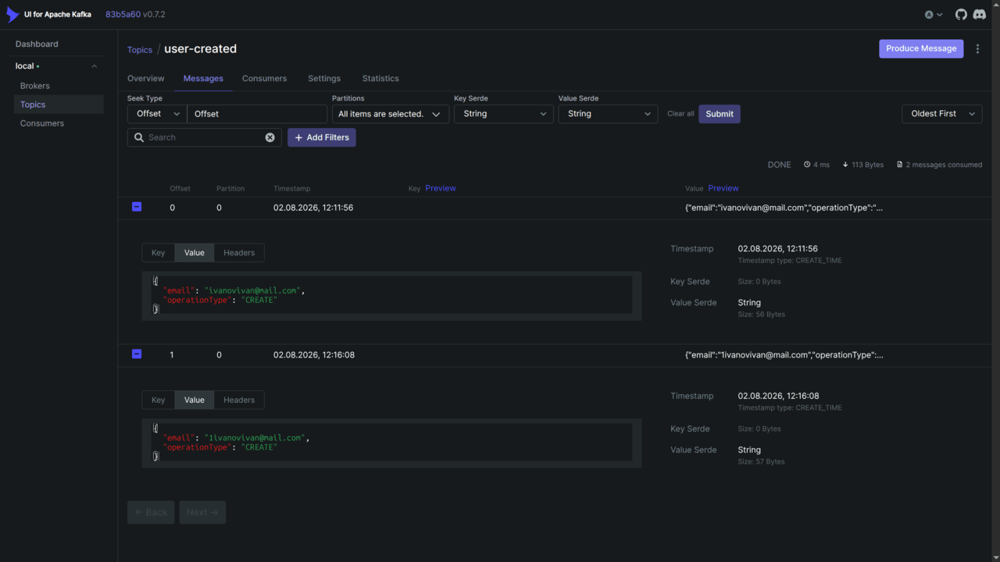
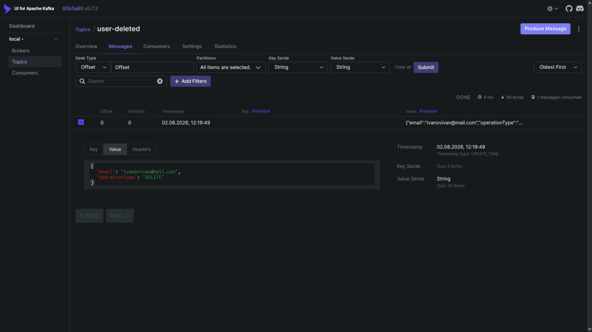
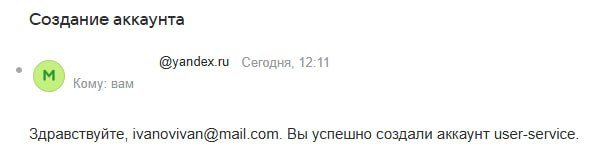
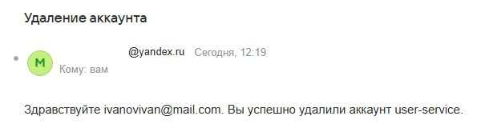
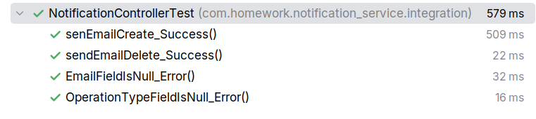
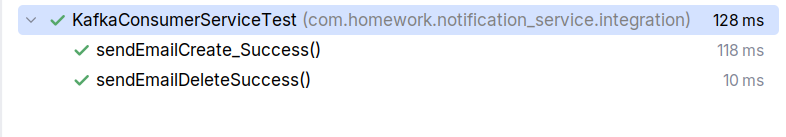

# Реализовать микросервис(notification-service) для отправки сообщения на почту при удалении или добавлении пользователя.
- Использовать необходимые модули spring и kafka.
- При удалении или создании юзера приложение, реализованное до этого(user-service), должно отправлять сообщение в kafka, в котором содержится информация об операции(удаление или создание) и email юзера.
- Новый микросервис(notification-service) должен получить сообщение из kafka и отправить сообщение на почту юзера в зависимости от операции: удаление - Здравствуйте! Ваш аккаунт был удалён. Создание - Здравствуйте! Ваш аккаунт на сайте ваш сайт был успешно создан.
- Также отдельно добавить API, которая будет отправлять сообщение на почту(почти тот же функционал, что и через кафку).
- Написать интеграционные тесты для проверки отправки сообщения на почту.
- - - 
### Запущенные контейнеры  
``` 
CONTAINER ID   IMAGE                           COMMAND                  CREATED          STATUS          PORTS                                         NAMES
ef4cfc8d1fae   postgres:15                     "docker-entrypoint.s…"   29 minutes ago   Up 29 minutes   0.0.0.0:5433->5432/tcp, [::]:5433->5432/tcp   postgres-user
0670e16b04bb   postgres:15                     "docker-entrypoint.s…"   29 minutes ago   Up 29 minutes   0.0.0.0:5434->5432/tcp, [::]:5434->5432/tcp   postgres-test
58884a52d6da   apache/kafka:latest             "/__cacert_entrypoin…"   29 minutes ago   Up 29 minutes   0.0.0.0:9092->9092/tcp, [::]:9092->9092/tcp   kafka
86ec5098d3b8   provectuslabs/kafka-ui:latest   "/bin/sh -c 'java --…"   29 minutes ago   Up 29 minutes   0.0.0.0:8085->8080/tcp, [::]:8085->8080/tcp   kafka-ui
``` 
- - - 
### Kafka. Топики, сообщения
  
  
  
- - -
### Сообщения на почте 
  


- - - 
### Тесты  
  

  
- - -